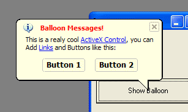

<div align="center">

## PBBalloon: Create Balloon Messages under any Windows\.


</div>

### Description

Using the ActiveX PBBalloon from PABLOB.NET I was able to create amazing Balloon Messages with links and Buttons under Windows 95, an action I thought impossible. Check the Screenshot!
 
### More Info
 


<span>             |<span>
---                |---
**Submitted On**   |
**By**             |[Andrew Collen](https://github.com/Planet-Source-Code/PSCIndex/blob/master/ByAuthor/andrew-collen.md)
**Level**          |Beginner
**User Rating**    |4.3 (26 globes from 6 users)
**Compatibility**  |VB 5\.0, VB 6\.0, VBA MS Access, VBA MS Excel
**Category**       |[Custom Controls/ Forms/  Menus](https://github.com/Planet-Source-Code/PSCIndex/blob/master/ByCategory/custom-controls-forms-menus__1-4.md)
**World**          |[Visual Basic](https://github.com/Planet-Source-Code/PSCIndex/blob/master/ByWorld/visual-basic.md)
**Archive File**   |[](https://github.com/Planet-Source-Code/andrew-collen-pbballoon-create-balloon-messages-under-any-windows__1-43028/archive/master.zip)


### Source Code

```
I have personally tested the ActiveX Control PBBalloon 1.2 from PABLOB.NET and I am really impressed!, using it, I was able to create Balloon Messages like the ones in Windows XP under Windows 95, and with features I’ve never seen, like Links and Buttons in the Balloons and the possibility to change the Balloon Text, Font and Colors while the Balloon is visible, That allows you to create cool Effects like the ones found in an example included in their download.
I have test it under Visual Basic 6, Visual Basic.NET, Visual C++ 6.0 and Office Applications without any problem at all.
I really recommend it!
```

